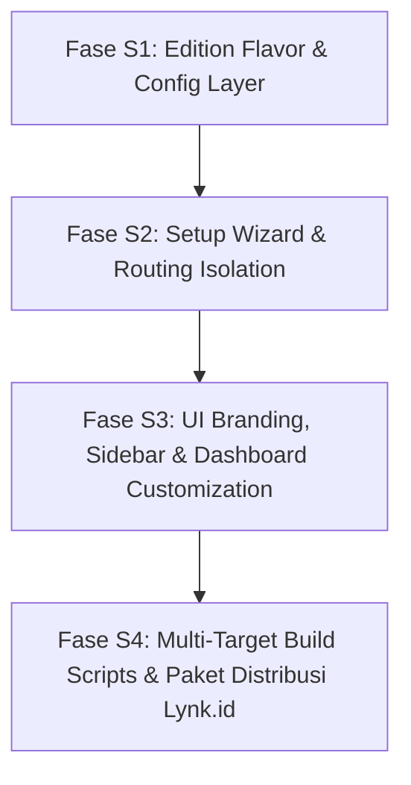

# Eksekusi Plan: Pemisahan 2 Produk Komersial (Fase per Fase)

Dokumen ini adalah **panduan eksekusi bertahap (Fase per Fase)** untuk membagi software ini menjadi **2 produk mandiri** (WA Bot Bisnis vs WA Asisten Pribadi) menggunakan pendekatan *Single Codebase, Dual Flavor Build*.

---

## 🎯 Aturan Eksekusi
1. **Satu Fase pada Satu Waktu:** AI hanya akan mengeksekusi satu fase dan tidak melompat ke fase berikutnya sebelum mendapatkan konfirmasi / perintah *"lanjut"* dari user.
2. **Kriteria Selesai Jelas (*Acceptance Criteria*):** Tiap fase memiliki syarat "Selesai Kalau" dan script verifikasi otomatis sebelum fase dianggap tuntas.
3. **Non-Destructive:** Kode inti tidak diduplikasi, melainkan dikontrol via edition flavor configuration.

---

## 📋 Ikhtisar Fase Eksekusi

---

## 🚀 Rincian Tiap Fase Eksekusi

### 🔹 FASE S1: Edition Flavor & Config Layer
**Fokus:** Membangun fondasi konfigurasi edisi produk tanpa mengubah logika WhatsApp/AI.

**Tugas:**
1. Buat `src/config/editions.js`:
   - Metadata edisi: `'bisnis'`, `'personal'`, `'all'` (Ultimate/Dual).
   - Menyimpan nama produk, tagline, warna tema, fitur yang diaktifkan, dan default setting per edisi.
2. Update `src/config/index.js`:
   - Tambahkan pembacaan `process.env.EDITION` atau file `config/edition.json`.
   - Tambahkan helper functions: `getEdition()`, `isBusinessEdition()`, `isPersonalEdition()`, `getEditionInfo()`.
   - Pastikan jika edisi terkunci (`'bisnis'` atau `'personal'`), nilai `config.mode` otomatis sesuai dan tidak bisa berubah secara tidak sengaja.
3. Buat script test unit: `scripts/test-phase-s1-flavor.js`.

**Selesai kalau:** Script `test-phase-s1-flavor.js` berhasil memvalidasi isolasi config untuk mode `'bisnis'`, `'personal'`, dan `'all'` tanpa error.

---

### 🔹 FASE S2: Setup Wizard & Routing Isolation
**Fokus:** Menyesuaikan alur Setup Wizard agar pembeli langsung diarahkan sesuai produk yang mereka beli.

**Tugas:**
1. Update `src/server/routes/setup.js`:
   - Jika Edisi Bisnis: Step 1 otomatis memilih mode Bisnis (atau langsung menampilkan welcome screen Bisnis $\to$ Step 2 Scan QR $\to$ Step 3 Gemini API Key $\to$ Step 4 Input Katalog Produk).
   - Jika Edisi Personal: Step 1 otomatis memilih mode Personal $\to$ Step 2 Scan QR $\to$ Step 3 Gemini API Key $\to$ Step 4 Input Kategori Pengeluaran / Budget Awal.
   - Jika Edisi All: Tetap menampilkan pilihan mode interaktif seperti biasa.
2. Update views wizard:
   - `src/server/views/setup/step-1-mode.ejs`
   - `src/server/views/setup/step-2-qr.ejs`
   - `src/server/views/setup/step-3-api-key.ejs`
   - `src/server/views/setup/step-4-initial-data.ejs`
3. Buat script test: `scripts/test-phase-s2-wizard-flow.js`.

**Selesai kalau:** Wizard untuk kedua edisi berhasil disimulasikan dan menghasilkan `config.json` yang sesuai untuk masing-masing edisi.

---

### 🔹 FASE S3: UI Branding, Sidebar & Dashboard Customization
**Fokus:** Menyesuaikan antarmuka web dashboard agar 100% tampak sebagai produk terpisah yang profesional dan rapi.

**Tugas:**
1. Update `src/server/views/partials/header.ejs`:
   - Title browser & navbar title dinamis (misal: *"WA Bot Bisnis AI"* vs *"WA Asisten Pribadi AI"*).
   - Badge dan favicon/icon adaptif.
2. Update `src/server/views/partials/sidebar.ejs`:
   - Filter menu ketat: Edisi Bisnis hanya menampilkan menu Bisnis (Dashboard, Analytics, Products, Customers, Orders, FAQs, Knowledge, Handover).
   - Edisi Personal hanya menampilkan menu Personal (Dashboard, Expenses, Budgets, Reminders, Todos, Notes, Habits, Events, Journals, Goals, Export).
3. Update `src/server/views/dashboard/settings.ejs`:
   - Sembunyikan opsi ganti mode jika software berjalan pada edisi khusus (*locked edition*).
4. Buat script audit UI: `scripts/test-phase-s3-ui-branding.js`.

**Selesai kalau:** Dashboard untuk kedua edisi diuji render dan semua elemen UI bersih dari menu edisi lain.

---

### 🔹 FASE S4: Multi-Target Build Scripts & Paket Distribusi Lynk.id
**Fokus:** Otomasi build `.exe` dan pembuatan struktur folder ZIP siap jual.

**Tugas:**
1. Update `scripts/build-exe.js` untuk menerima argumen:
   - `npm run build:bisnis` $\to$ Menghasilkan folder `dist/wa-bot-bisnis/` berisi `wa-bot-bisnis.exe`.
   - `npm run build:personal` $\to$ Menghasilkan folder `dist/wa-bot-personal/` berisi `wa-bot-personal.exe`.
   - `npm run build:all` $\to$ Menghasilkan kedua paket secara bersamaan.
2. Tambahkan skrip `package.json` yang sesuai.
3. Buat file panduan siap pakai untuk pembeli di dalam masing-masing folder:
   - `dist/wa-bot-bisnis/PANDUAN_PENGGUNAAN_BISNIS.txt`
   - `dist/wa-bot-personal/PANDUAN_PENGGUNAAN_PERSONAL.txt`
4. Buat skrip deployment VPS terpisah per edisi:
   - `scripts/deploy-vps-bisnis.sh`
   - `scripts/deploy-vps-personal.sh`
5. Jalankan verifikasi build end-to-end.

**Selesai kalau:** Perintah build menghasilkan 2 executable mandiri yang dapat dijalankan secara terpisah dan langsung membuka dashboard edisinya masing-masing.
